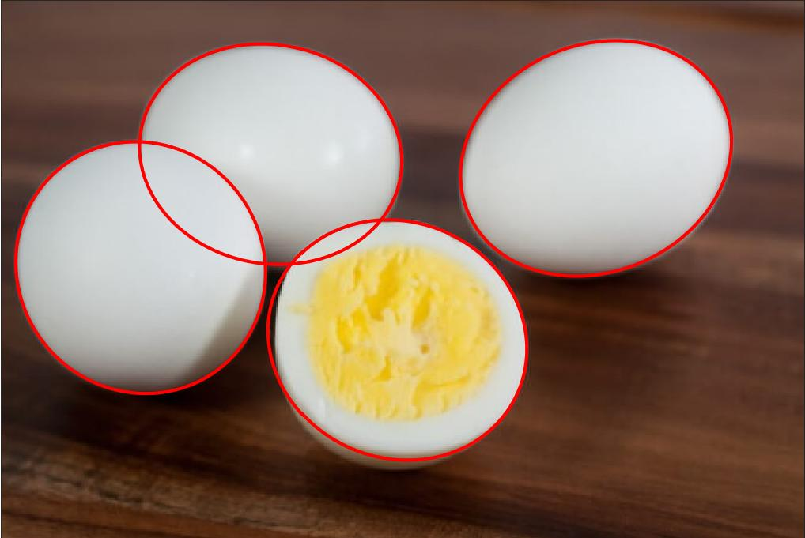
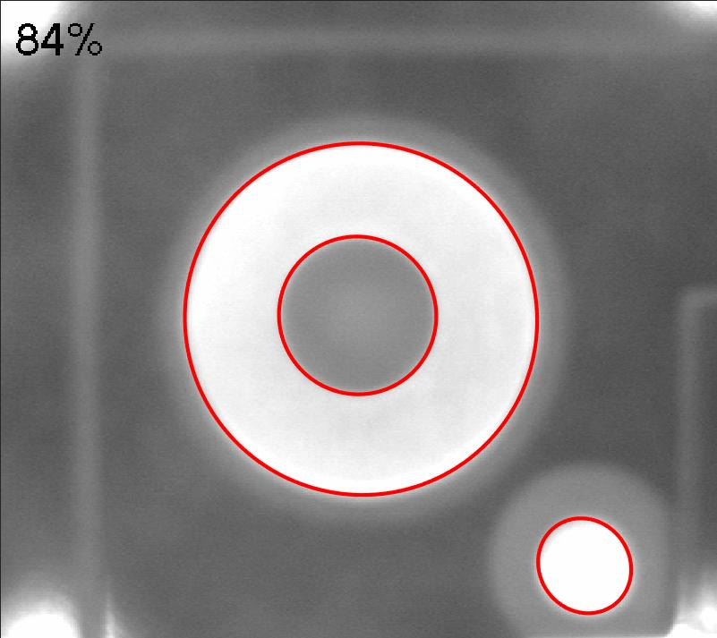
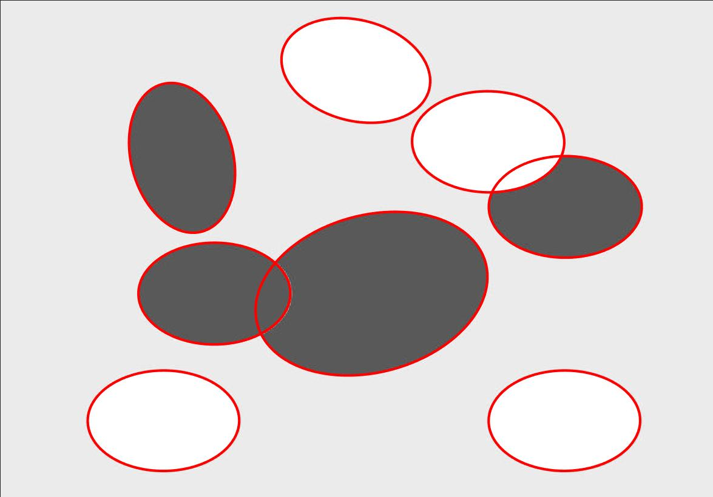
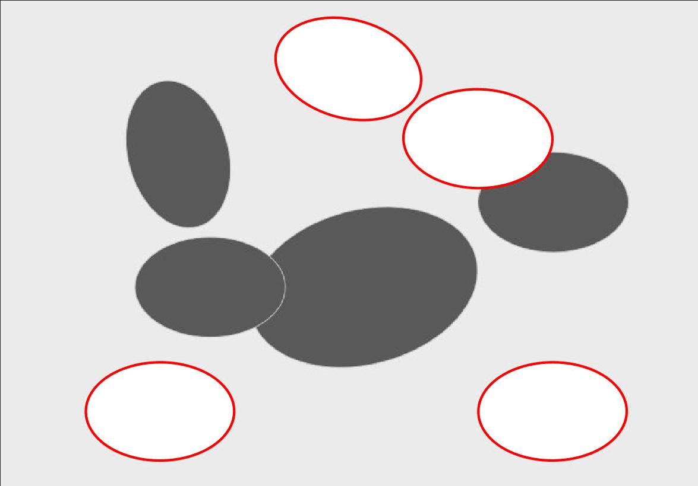
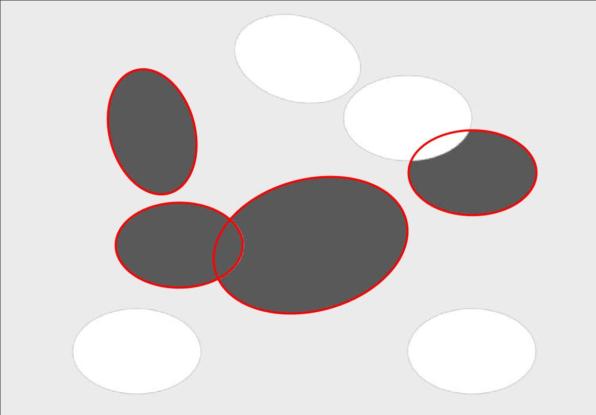

# High-quality Ellipse Detection
## 1. Illustration
- This is the source code for the paper [High-quality Ellipse Detection Based on Arc-support Line Segments](https://alanlusun.github.io/publication/2018-09-24-High-quality-Ellipse-Detection/).
- The main contribution of the proposed ellipse detector is to both accurately and efficiently detect ellipses in images, which is universally considered as a tough and long-standing problem in ellipse detection field. The proposed ellipse detector owns the features of *high localization accuracy, efficiency, robustness*, and *stability*, which comprehensively yields high-quality ellipse detection performance in front of real-world images. 
- There are only *two* extrinsic parameters, namely the elliptic angular coverage *Tac* and the ratio of support inliers *Tr*, which enables the proposed ellipse detector to be conveniently used and applied in real applications. In addition, the *specified_polarity* option can help users find the polarity-specific ellipses in the image.  
- The source code is free for academic use. Please cite our paper if you use the source code, thanks.

## 2. Requirements
- MATLAB
- OpenCV (Version 2.4.9)
- 64-bit Windows Operating System

## 3. How to use
- Firstly, compile the file "generateEllipseCandidates.cpp" in MATLAB on your computer to generate the mex file "generateEllipseCandidates.mexw64" with the following command:  
  
  ---
  mex generateEllipseCandidates.cpp -IF:\OpenCV\opencv2.4.9\build\include -IF:\OpenCV\opencv2.4.9\build\include\opencv -IF:\OpenCV\opencv2.4.9\build\include\opencv2 -LF:\OpenCV\opencv2.4.9\build\x64\vc11\lib -LF:\Matlab\settlein\extern\include -LF:\Matlab\settlein\extern\lib\win64\microsoft -lopencv_core249 -lopencv_highgui249 -lopencv_imgproc249 -llibmwlapack.lib  
  
  ---
  Notably, the corresponding software paths of OpenCV and MATLAB, namely the "F:\OpenCV\opencv2.4.9\" and "F:\Matlab\settlein\", should be replaced to your own.  
- Secondly, run the demo file "LCS_ellipse.m".

## 4. Examples
*Some high-quality ellipse detection examples run with default parameters and on the same computer with Intel Core i7-7500U 2.7GHz CPU and 8 GB memory*

### 4.1 Detecting all ellipses in the image

---
- The number of detected ellipses: 4; Running time: 0.090s; Resolution: 651 x 436
    
  
---
- The number of detected ellipses: 25; Running time: 0.460s; Resolution: 720 x 435
   

---
- The number of detected ellipses: 3; Running time: 0.060s; Resolution: 512 x 456
   

---
- The number of detected ellipses: 8; Running time: 0.110s; Resolution: 752 x 525
   

### 4.2 Detecting the ellipses with positive polarity  
- The number of detected ellipses: 4; Running time: 0.080s; Resolution: 752 x 525
   

### 4.3 Detecting the ellipses with negative polarity
- The number of detected ellipses: 4; Running time: 0.086s; Resolution: 752 x 525
   

## 5. Successful Application Cases
- Car Wheel Hub Recognition
- PCB Inspection
- Object Fingerprinting
- Robot Vision

